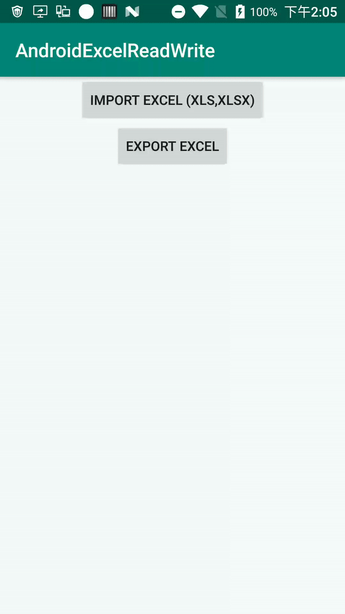

## Excel read and write for android(support xls,xlsx)

The code is relatively simple, you can see the effect after running.

### libs
`Apache POI`

### screenshot

### thanks
1. https://github.com/andruhon/android5xlsx
2. https://blog.csdn.net/u014743890/article/details/91045033